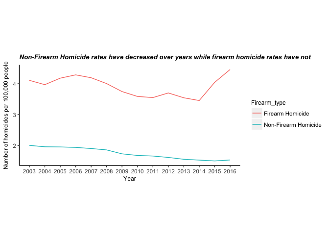
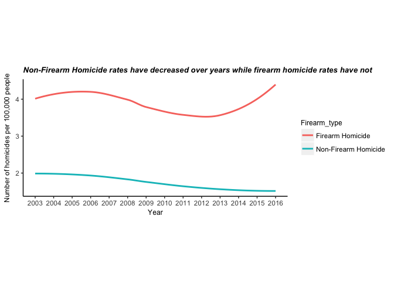
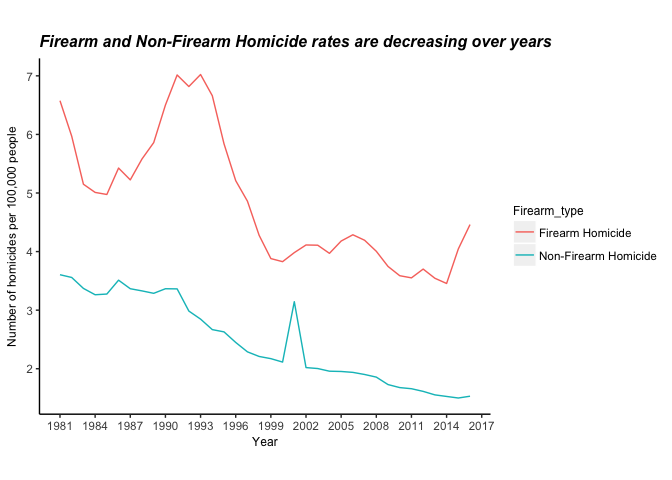
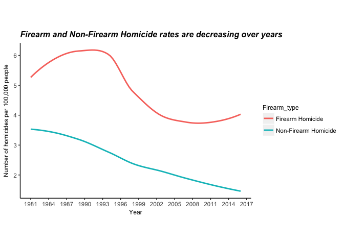
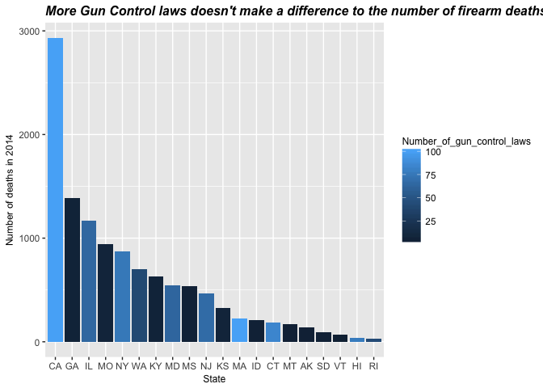
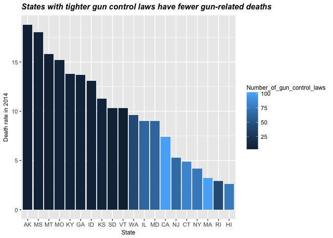
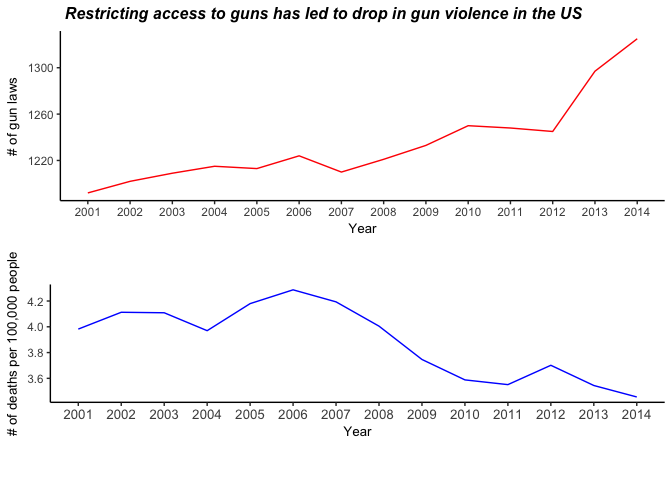
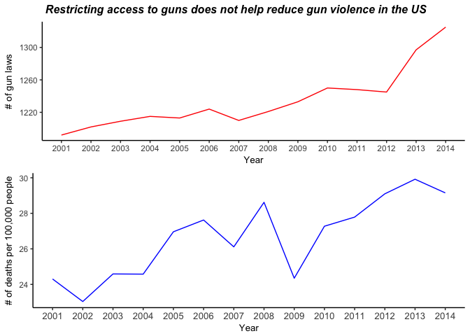

Deceptive Version - America’s unique gun violence problem
================
Preethi S Ranganathan
5/14/2018

**Data Product:** America’s unique gun violence problem
<https://www.vox.com/policy-and-politics/2017/10/2/16399418/us-gun-violence-statistics-maps-charts>

The data product, is about the Gun Violence in the United States. The
maps and charts in the data product show what gun violence looks like
compared with the rest of the world and also how prevalent it is in the
US, why it happens, and why it’s such a tough problem to fix.

Here, I present a deceptive version of the claims made in the data
product. I have picked three arguments from the product and made
misleading graphs based on them.

``` r
library(dplyr)
library(ggplot2)
library(gdata)
library(gridExtra)
library(stringr)
library(varhandle)
library(ggpubr)
```

**Deceptive chart argument 1:** Homicide rates have declined over years
whereas firearm homicide rates have not (there is no
increasing/decreasing trend over years).

**Actual Argument 1:** Gun homicides (like all homicides) have declined
over the years.(Chart 9)

To explain the importance of gun violence in the US, it is better, if we
show the audience that the gun violence has increased over the years
instead of showing the opposite.

Hence, I replicated the plot and it showed the same trend as in the data
product. To make the main argument more compelling, I decided to pick up
just the increasing trend. But there is no increasing trend in homicides
(except during 2015 and 2016, which is very minimal).

So, I decided to limit the time period which has a constant trend
(neither increasing nor decreasing) of homicide rate.

**Improvement:** It would have been a lot better if we have shown
increasing trend of homicide rates. Unfortunately, we don’t have such
data.

**Datasets:** Firearm and Non-firearm homicides- Centers for Disease
Control and Prevention
<https://webappa.cdc.gov/sasweb/ncipc/mortrate10_us.html>

**Note:** Here, homicides does not include deaths inflicted by the
police or other law-enforcing agents in the course of arresting or
attempting to arrest lawbreakers.

\#Firearm Homicide data files from 1981 to
2015

``` r
firearmhomicidefiles <- list.files(path='~/Documents/Santa Clara/data viz/indiv proj/homicide',full.names = TRUE, pattern = ".csv")
d=data.frame()
for(i in 1:length(firearmhomicidefiles)){
  d=rbind(read.table(firearmhomicidefiles[i],sep=',',header=TRUE),d)
}
firearm_homicide=data.frame(d[,6],d[,9],d[,10])
firearm_homicide=unique(firearm_homicide)
colnames(firearm_homicide)<- c('Year','Deaths','Population')
firearm_homicide$Firearm_type='Firearm Homicide'
```

\#Non-Firearm Homicide data files from 1981 to
2015

``` r
nonfirearmhomicidefiles <- list.files(path='~/Documents/Santa Clara/data viz/indiv proj/non-firearm-homicides',full.names = TRUE, pattern = ".csv")
d=data.frame()
for(i in 1:length(nonfirearmhomicidefiles)){
  d=rbind(read.table(nonfirearmhomicidefiles[i],sep=',',header=TRUE),d)
}
nonfirearm_homicides=data.frame(d[,7],d[,9],d[,10])
nonfirearm_homicides=unique(nonfirearm_homicides)
colnames(nonfirearm_homicides)<- c('Year','Deaths','Population')
nonfirearm_homicides$Firearm_type='Non-Firearm Homicide'
```

\#Merge and
normalized

``` r
homicides=merge(firearm_homicide, nonfirearm_homicides ,by.x='Year',by.y='Year',all=TRUE)
homicides=data.frame(homicides[,1],homicides[,2],homicides[,3],homicides[,4])
colnames(homicides)<-c('Year','Firearm','Population','Nonfirearm')
homicides$Firearm_norm<-(homicides$Firearm/homicides$Population)*100000
homicides$NonFirearm_norm<-(homicides$Nonfirearm/homicides$Population)*100000
```

\#Combining firearm and non-firearm homicides

``` r
homicides1=rbind(firearm_homicide,nonfirearm_homicides)
homicides1$norm<-(homicides1$Deaths/homicides1$Population)*100000
```

**Deceptive plot:**

``` r
homcides_cut=homicides1[homicides1$Year>2002,]

ggplot(homcides_cut) +geom_line(aes(Year, norm,color=Firearm_type ))+ggtitle('Non-Firearm Homicide rates have decreased over years while firearm homicide rates have not')+theme(panel.grid.major = element_blank(), panel.grid.minor = element_blank(), panel.background = element_blank(),  axis.line = element_line(colour = "black"), plot.title = element_text( size=10, face="bold.italic"),axis.title= element_text( size=9),legend.title= element_text( size=9))+ labs(x='Year',y = "Number of homicides per 100,000 people")+ scale_x_continuous(breaks=seq(2003,2017,1))+coord_fixed(ratio = 2)
```

<!-- -->

**Smoothened Deceptive
plot:**

``` r
ggplot(homcides_cut) +geom_smooth(aes(Year, norm,color=Firearm_type), se=FALSE)+ggtitle('Non-Firearm Homicide rates have decreased over years while firearm homicide rates have not ')+theme(panel.grid.major = element_blank(), panel.grid.minor = element_blank(), panel.background = element_blank(), axis.line = element_line(colour = "black"), plot.title = element_text( size=10, face="bold.italic"),axis.title= element_text( size=9),legend.title= element_text( size=9))+ labs(x='Year',y = "Number of homicides per 100,000 people")+scale_x_continuous(breaks=seq(2003,2017,1))+coord_fixed(ratio = 2)
```

    ## `geom_smooth()` using method = 'loess'

<!-- -->

**Actual Plot
(1981-2016):**

``` r
ggplot(homicides1) +geom_line(aes(Year, norm,color=Firearm_type ))+ggtitle('Firearm and Non-Firearm Homicide rates are decreasing over years ')+theme(panel.grid.major = element_blank(), panel.grid.minor = element_blank(), panel.background = element_blank(), axis.line = element_line(colour = "black"), plot.title = element_text( size=12, face="bold.italic"),axis.title= element_text( size=9),legend.title= element_text( size=9))+ labs(x='Year',y = "Number of homicides per 100,000 people")+ scale_x_continuous(breaks=seq(1981,2017,3))+ coord_fixed(ratio = 5)
```

<!-- -->

**Actual plot (1981-2016
-Smoothened):**

``` r
ggplot(homicides1) +geom_smooth(aes(Year, norm,color=Firearm_type), se=FALSE)+ggtitle('Firearm and Non-Firearm Homicide rates are decreasing over years ')+theme(panel.grid.major = element_blank(), panel.grid.minor = element_blank(), panel.background = element_blank(), axis.line = element_line(colour = "black"), plot.title = element_text( size=12, face="bold.italic"),axis.title= element_text( size=9),legend.title= element_text( size=9))+ labs(x='Year',y = "Number of homicides per 100,000 people")+ scale_x_continuous(breaks=seq(1981,2017,3))+coord_fixed(ratio = 5)
```

    ## `geom_smooth()` using method = 'loess'

<!-- -->

**Deceptive Argument 2:** Tighter gun control laws does not reduce the
number of gun-related deaths.

**Actual Argument:** States with tighter gun control laws have fewer
gun-related deaths.

This is one of the main claims made by the data product. So, I picked
this chart and made a decptive version out of it.

I picked the states with high gun control laws and states with less gun
control laws to see a clear difference in gun deaths between states with
high gun control laws and low gun control laws. Here, I normalized the
number of deaths in each state per 100,000 people so that the population
of each state is taken into consideration. I also noticed that death
rate was not dependent on population in this chart.

Hence, I decided to make a deceptive chart without normalizing for
population ie.,I made the y axis as raw number of deaths, not death rate
per 100,000 people. As I expected, the chart showed that states with
high gun control laws has no correlation with gun deaths.

**Improvement:** It would have been better, if I had picked few states
where gun deaths are prevalent and plotted a time trend of change in
number of control laws and change in gun deaths over years. There could
be numerous factors in each state, which could cause an increase in gun
deaths. By comparing gun deaths of one state across different years, we
control for other factors causing gun deaths in different states.

**Datasets:** Gun control laws -
<https://www.statefirearmlaws.org/table.html> Gun deaths-
<https://www.cdc.gov/nchs/pressroom/sosmap/firearm_mortality/firearm.htm>

**Note:** Here, I have considered statewise number of gun control laws
and gun deaths in 2014.

\#Gun control laws by state vs Gun Deaths

``` r
# Gun control laws for each state and year
gun_control=read.csv('~/Documents/Santa Clara/data viz/indiv proj/raw_data.csv',header=TRUE) 

# Gun control for 2014
gun_control=gun_control[gun_control[,2]==2014,]
gun_control=data.frame(gun_control[,1],gun_control[,136])
colnames(gun_control)<-c('State','Number_laws')

# Statewise gun death data -2014
gundeaths2014=read.xls('~/Documents/Santa Clara/data viz/indiv proj/Gun_Deaths_statewise.xlsx',header=TRUE, sheet=2)

# Filtering states with high number of gun control laws
highlaws=data.frame(gun_control[order(-gun_control$Number_laws),][1:10,])
lesslaws=data.frame(gun_control[order(gun_control$Number_laws),][1:10,])
highlaws$Number_GunControl_Laws='high'
lesslaws$Number_GunControl_Laws='low'
highlow=rbind(highlaws,lesslaws)

# Merging data sets
gun_control_deaths=merge(gundeaths2014, highlow ,by.x='STATE.NAME',by.y='State')
guncontrol_deaths=data.frame(gun_control_deaths[,2], gun_control_deaths[,3], gun_control_deaths[,4], gun_control_deaths[,6], gun_control_deaths[,10])
colnames(guncontrol_deaths)<-c("State",'population','Deathrate','Deaths_num','Number_of_gun_control_laws')
guncontrol_deaths$population<-as.numeric(str_replace_all(guncontrol_deaths$population,",",""))
```

**Deceptive
plot:**

``` r
ggplot(guncontrol_deaths, aes(reorder(State, -Deaths_num), Deaths_num , fill=Number_of_gun_control_laws)) +geom_col(position ='dodge') +ggtitle('More Gun Control laws doesn\'t make a difference to the number of firearm deaths')+theme(plot.title = element_text( size=12, face="bold.italic"),axis.title= element_text( size=9),legend.title= element_text(size=9))+ labs(x='State',y = "Number of deaths in 2014")
```

<!-- -->

**Actual
plot:**

``` r
ggplot(guncontrol_deaths, aes(reorder(State, -Deathrate), Deathrate , fill=Number_of_gun_control_laws)) +geom_col(position ='dodge') +ggtitle('States with tighter gun control laws have fewer gun-related deaths')+theme(plot.title = element_text( size=12, face="bold.italic"),axis.title= element_text( size=9),legend.title= element_text( size=9))+ labs(x='State',y = "Death rate in 2014")
```

<!-- -->

**Deceptive Argument 3:** As the number of gun control laws has
increased in the US over years, gun violence has reduced. New legal
restrictions on owning and purchasing guns tended to be followed by a
drop in gun violence — a strong indicator that restricting access to
guns can save lives.

This argument is from the data product, but this is also deceptive.

**Actual Argument:** The actual argument (suggested by me) is that
restricting access to guns has not saved lives. Gun violence has
increased as the number of gun control laws has increased over years.

The deceptive argument presented in the data product did not take into
account, the total number of firearm violence as a sum of gun homicides,
suicides and non-fatal injuries.

The entire data product is just focussing on the homicide rates or
suicides rates seperately, sometimes both. But, it never considered the
number of gun injuries. So, I tried plotting the total firearam
casualties as a sum of gun homicides, suicides and non-fatal injuries
which clearly showed that there has been an increasing trend of gun
casualties over years.

The decrease in homicide rate could be due to improved medical
facilities and emergency services in the recent years.
<https://www.umass.edu/newsoffice/article/research-finds-us-murder-rate-suppressed-improved-emergency-medical-response>

**Improvement:** This could be verified by importing a Emergency Medical
Service (EMS) dataset, and checking the trend to correlate with decrease
in homicide rate.

**Datasets**: Firearm casualties-
<https://webappa.cdc.gov/sasweb/ncipc/mortrate10_us.html> Gun control
laws- <https://www.statefirearmlaws.org/table.html>

``` r
# Non-fatal gun injury
gun_injuryfiles <- list.files(path='~/Documents/Santa Clara/data viz/indiv proj/firearm_injuries',full.names = TRUE, pattern = ".csv")
d=data.frame()
for(i in 1:length(gun_injuryfiles)){
  d=rbind(read.table(gun_injuryfiles[i],sep=',',header=TRUE),d)
}
gun_injury=data.frame(d[,4],d[,7])
colnames(gun_injury)<-c('Year','Number_injuries')
gun_injury=gun_injury[gun_injury$Year>2000&gun_injury$Year<2015,]
gun_injury$Number_injuries=as.integer(str_replace_all(unfactor(gun_injury$Number_injuries),',',''))

# Gun homicides
firearmhomicidefiles <- list.files(path='~/Documents/Santa Clara/data viz/indiv proj/homicide',full.names = TRUE, pattern = ".csv")
d=data.frame()
for(i in 1:length(firearmhomicidefiles)){
  d=rbind(read.table(firearmhomicidefiles[i],sep=',',header=TRUE),d)
}
firearm_homicide=data.frame(d[,6],d[,9],d[,10])
firearm_homicide=unique(firearm_homicide)
colnames(firearm_homicide)<- c('Year','Homicides','Population')
firearm_homicide=firearm_homicide[firearm_homicide$Year>2000&gun_injury$Year<2015,]
```

    ## Warning in firearm_homicide$Year > 2000 & gun_injury$Year < 2015: longer
    ## object length is not a multiple of shorter object length

``` r
# Gun suicides
suicidefiles <- list.files(path='~/Documents/Santa Clara/data viz/indiv proj/firearm_suicide',full.names = TRUE, pattern = ".csv")
d=data.frame()
for(i in 1:length(suicidefiles)){
  d=rbind(read.table(suicidefiles[i],sep=',',header=TRUE),d)
}
suicide=data.frame(d[,6],d[,9])
suicide=unique(suicide)
colnames(suicide)<- c('Year','Suicides')
suicide=suicide[suicide$Year>2000&gun_injury$Year<2015,]
```

    ## Warning in suicide$Year > 2000 & gun_injury$Year < 2015: longer object
    ## length is not a multiple of shorter object length

``` r
## Total firearam casualties as a sum of gun homicides, suicides and non-fatal injuries
gun_casualties<-merge(firearm_homicide,suicide,by.x='Year',by.y='Year')
gun_casualties<-merge(gun_casualties,gun_injury,by.x='Year',by.y='Year')
gun_casualties$Total_casualties<-gun_casualties$Homicides+gun_casualties$Suicides+gun_casualties$Number_injuries
gun_casualties$Total_casualties_rate<-(gun_casualties$Total_casualties/gun_casualties$Population)*100000
gun_casualties$Homicide_rate<-(gun_casualties$Homicides)*100000/gun_casualties$Population 
```

\#Gun control laws vs Gun Violence over
years

``` r
gun_control=read.csv('~/Documents/Santa Clara/data viz/indiv proj/raw_data.csv',header=TRUE) 
gun_control=data.frame(gun_control[,2],gun_control[,136])
colnames(gun_control)<-c('Year','Number_laws')
gun_control=gun_control %>% group_by(Year) %>% summarize(Number_laws=sum(Number_laws))

homicides_control=merge(gun_casualties, gun_control ,by.x='Year',by.y='Year',all=TRUE)
homicides_control=homicides_control[complete.cases(homicides_control),]
```

**Deceptive
plot:**

``` r
p9=ggplot(homicides_control) +geom_line(aes(Year, Homicide_rate ),col='blue')+theme(panel.grid.major = element_blank(), panel.grid.minor = element_blank(), panel.background = element_blank(),axis.line = element_line(colour = "black"),plot.title = element_text( size=12, face="bold.italic"),axis.title= element_text( size=10))+ labs(x='Year',y = "# of deaths per 100,000 people")+ scale_x_continuous(breaks=seq(2001,2014,1))+ coord_fixed(ratio = 3)

p11=ggplot(homicides_control) +geom_line(aes(Year, Number_laws ),col='red')+ggtitle(' Restricting access to guns has led to drop in gun violence in the US')+theme(panel.grid.major = element_blank(), panel.grid.minor = element_blank(), panel.background = element_blank(),axis.line = element_line(colour = "black"),plot.title = element_text( size=12, face="bold.italic"),axis.title= element_text(size=10))+ labs(x='Year',y = "# of gun laws") + scale_x_continuous(breaks=seq(2001,2014,1))

ggarrange(p11, p9 + font("x.text", size = 10),
                    ncol = 1, nrow = 2)
```

<!-- -->

**Actual
plot:**

``` r
p10=ggplot(homicides_control) +geom_line(aes(Year, Total_casualties_rate ),col='blue')+theme(panel.grid.major = element_blank(), panel.grid.minor = element_blank(), panel.background = element_blank(),axis.line = element_line(colour = "black"),plot.title = element_text( size=12, face="bold.italic"),axis.title= element_text( size=10),legend.title= element_text( size=10, face="bold.italic"))+ labs(x='Year',y = "# of deaths per 100,000 people")+ scale_x_continuous(breaks=seq(2001,2014,1))

p11=ggplot(homicides_control) +geom_line(aes(Year, Number_laws ),col='red')+ggtitle(' Restricting access to guns does not help reduce gun violence in the US')+theme(panel.grid.major = element_blank(), panel.grid.minor = element_blank(), panel.background = element_blank(),axis.line = element_line(colour = "black"),plot.title = element_text( size=12, face="bold.italic"),axis.title= element_text(size=10))+ labs(x='Year',y = "# of gun laws") + scale_x_continuous(breaks=seq(2001,2014,1))

ggarrange(p11, p10 + font("x.text", size = 10),
                    ncol = 1, nrow = 2)
```

<!-- -->
